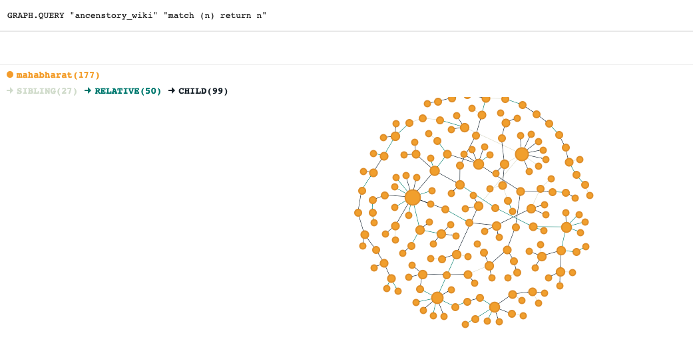

### Ancestry Wiki 


Explore a fun way to learn about history and ancestory of famous personalities using `RedisGraph`

### Set up

- Install services from the `docker-compose.yml` file included to set up `RedisGraph` and `RedisInsight` 
- Set up python virtual env with the `requirements.txt` file included. This project requires Python `3.14` and above.
- Run script `main.py` by providing your entry point url from which you want to start unraveling ancestory information.
```commandline
$> python main.py -u https://en.wikipedia.org/wiki/Zeus -l Greek 
```
- Go to `RedisInsight` console at `localhost:8001`. Navigate to `RedisGraph` and use the OpenCypher query interface there to uncover insights from the ancestory data ingested. 

### Use cases

- Traverse full lineage in all directions (Spouse, Parents, Children, Siblings, Relatives etc)
- Query for important characters and timeline with additional metadata for each node provided. 
- Learn more interactively about lesser known characters related to popular characters. 
- Use custom labels to crawl different themes and find interconnections


